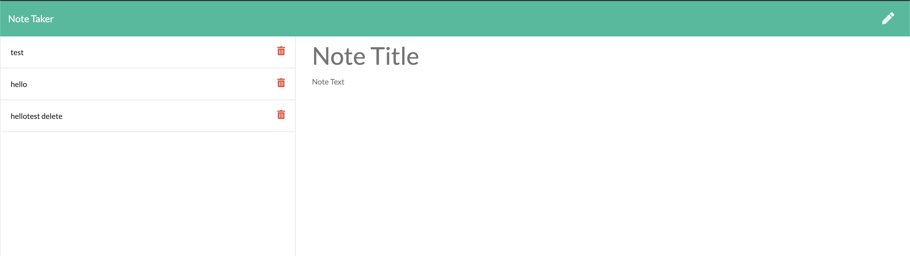

# Note Taker

## Description

This will save save a note and edit a note as well as delete a note (you have to refresh in order to see the note deleted)
    

## Table of Contents
* [Usage](#usage)
* [Heroku] (#heroku)
* [ScreenShot](#screenshot)
* [Technologies]
* [Contributing](#contributing)
* [Questions](#questions)

## Usage
    Go to the parent folder in terminal
    then just run 
    npm start  or go to the Heroku deployed page

## Heroku
Here is the link to the page deployed via heroku

## Screenshot

## Contributing
Please contribute safely
    
## Questions
### Where is my GitHub repository?
[GitHub](https://github.com/chattean)

### How to get in Contact with me if you have additional questions?
anujchatterjee@gmail.com
    

